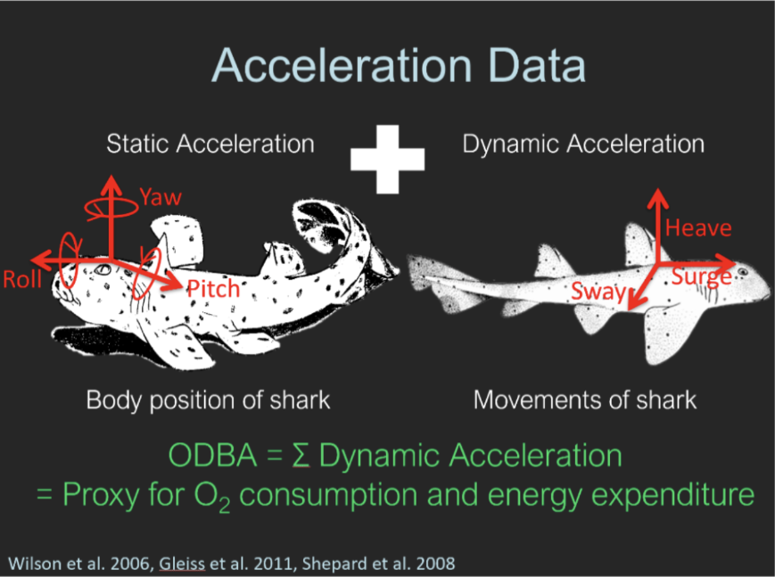

<!-- To be able to have continuous line numbers -->
```{=html}
<style>
body
  { counter-reset: source-line 0; }
pre.numberSource code
  { counter-reset: none; }
</style>
```

```{r setup, include=FALSE}
knitr::opts_chunk$set(echo = TRUE)
knitr::opts_chunk$set(warning = FALSE)
knitr::opts_chunk$set(cache = TRUE)
knitr::opts_chunk$set(message = FALSE)
```


# Tutorial objectives


The aim of this tutorial is to delve into the process of fitting hidden Markov models (HMMs) to accelerometer data, integrating covariates into transition probabilities, and employing a classic model selection criterion to choose the most suitable model from a set of candidates. For all of this procedures, we will be using the R package `momentuHMM`, introduced in first part of this workshop series. 

The primary learning objectives in this first tutorial are to:

  - Fit a basic HMM to accelerometer data using `momentuHMM`
  - Incorporating and interpreting covariates on behaviour transition probabilities
  - Visualizing the Depth time series with decoded states
  - Use the Akaike Information Criteria for model selection
  - Practice what you've learned by working on exercises

# Accelerometer data

Accelerometer devices measure up to three axes, which can be described relative to the body of the animal: longitudinal (surge), lateral (sway) and dorsoventral (heave). These devices are becoming more prevalent in the fields of animal biologging data as they provide a means of measuring activity in a meaningful and quantitative way. From tri-axial acceleration data, we can also derive several measures that summarize effort or exertion and relate acceleration  to activity levels such as overall dynamic body acceleration (ODBA) and vectorial dynamic body acceleration (VeDBA).

```{r,fig.align='center',echo=F}




```

ODBA and VeDBA can be used to reduce the dimensionality of three-dimension acceleration data while retaining important information. Further, because acceleration data is often at high temporal resolutions over time, it also naturally exhibits a large degree of autocorrelation, making it impossible to assume independence between sequential observations. HMMs can account for the autocorrelation present in the data while assuming that the data were generated according to a finite set of (unobserved) behaviors making them a good candidate model for this type of data structure.

## Blacktip Reef Shark data

In this tutorial, we will be analyzing four days' worth of acceleration data from a free-ranging blacktip reef shark in the Palmyra Atoll located in the central Pacific Ocean. The acceleration data was collected from a 117-cm female shark (*Carcharhinus melanopterus*) species using a multisensor package. This package was attached to the shark's dorsal fin and recorded three-dimensional acceleration data at a rate of 20 Hz. It also recorded depth and water temperature at a rate of 1 Hz. After four days, the package, which was equipped with a VHF transmitter, detached from the shark and could be retrieved from the water surface (Papastamatiou et al. 2015). To assess the shark's active behavior, the authors calculated the average ODBA over 1-second intervals, resulting in a dataset comprising 320,214 observations. Consequently, the variables in the dataset consist of time of day, water temperature (in Celsius), depth (in meters), and ODBA.

```{r}
# R packages that will be used for this tutorial
library(readr)
library(momentuHMM)
library(ggplot2)
library(dplyr)
library(lubridate)


# Load data 
BlacktipB <- read_delim("BlacktipB.txt", 
                        delim = "\t", escape_double = FALSE, 
                        trim_ws = TRUE)

```

```{r}
head(BlacktipB)
```

Exploring a quick exploration of the data, we observe there are no missing values, so we don't have to worry about data imputation or data gaps.

```{r}
sum(is.na(BlacktipB))
```

## Data processing 

Looking at the ODBA values throughout the observed period, we find ODBA is unusually high at some times -- for this shark we assumed that values between 0 and 2 were consistent with what we expected. The dashed blue line in the plot below corresponds to a ODBA value of 2, so those values that are above this line correspond to these high ODBA values throught the observed time period:

```{r, fig.height= 4, fig.width=12,echo=T}

BlacktipB_aux = BlacktipB %>% 
  mutate(Time = as.POSIXct(Time,format = "%m/%d/%Y %H:%M")) 

BlacktipB_aux %>% 
  ggplot(aes(Time,ODBA)) + 
  geom_line() + geom_hline(yintercept = 2,linetype="dashed",color="blue")
```

Because accommodating extreme values can pose a problem for identification of an adequate state-dependent distribution in our HMM, we removed them from the data set. However, note that in general, deciding whether to remove extreme values or not will more likely depend on whether we find appropriate distributional forms that can accommodate them. Generally, we need to make sure that extreme values are in fact some artefact of the data collection process, not representative of a behavior of interest, or inconsistent with what we are trying to capture as well. Removing data is not good general practice but instead we can assess on a case-by-case basis.

While high-resolution data is often preferred for its ability to provide extensive information through detailed observations, it's important to consider the potential drawbacks, as highlighted in the animal movement tutorial. One significant disadvantage of fine-scale resolution is the high autocorrelation among observations made at smaller time intervals. This increased autocorrelation can present challenges when fitting a HMM because the model may not adequately account for it. In this tutorial, we will specifically work with 1-minute average depth, temperature, and ODBA values. This significantly reduces both the time required for the model fitting process and the autocorrelation between observations. Furthermore, since we are using 1-minute averages, irregular emissions are not a concern. Finally, we will modify the variable associated with the time of day in order to be properly formatted.

```{r}
# Transform into proper time format and take 1-min avg
BlacktipB_1min = BlacktipB %>% filter(ODBA <= 2) %>%  
  mutate(Time = as.POSIXct(Time,format = "%m/%d/%Y %H:%M")) %>% 
  group_by(Time = floor_date(Time, unit = "1 min")) %>%
  summarise(ODBA_avg = mean(ODBA),
            temp_avg = mean(Temp),
            depth_avg = mean(Depth)) %>%
  ungroup() %>%
  mutate(Time = as.POSIXct(Time,format = "%Y-%m-%d %H:%M:%S")) %>%
  as.data.frame()
  
head(BlacktipB_1min)
```


After transforming the data, we now observe the 1-minute average ODBA time series across the four days in the plot below. The horizontal red lines provide a visual reference for what might represent the mean of two potential behaviors. These behaviors could be attributed to "low-activity" (for the lower values) and "high-activity" (associated with relatively higher values).Therefore, we can start proposing the model fitting with two behavioural states. It's important to note that there are no occurrences at zero, as the purple horizontal line corresponds to the y-intercept where $y=0$.


```{r,echo=T, fig.height= 4, fig.width=12}
BlacktipB_1min %>% 
  ggplot(aes(Time,ODBA_avg)) + 
  geom_line()  + geom_hline(yintercept = .05, color = "red") +
    geom_hline(yintercept = .09, color = "red") +
  geom_hline(yintercept = 0, color = "purple")

```

Now, according to the histogram of the observations associated to the ODBA values, the distribution suggest that a gamma distribution could be appropiate to model the data stream. This is reforced by the fact that we don't have zero occurrences in this data stream, as can be visualized in the ODBA time series plot.

```{r, echo=T}
hist(BlacktipB_1min$ODBA_avg, 
     breaks = 80, 
     main="Histogram of ODBA", 
     xlab = "ODBA")
```


After selecting a data resolution and selecting a number of behaviour states, we are ready to start proposing candidate models for this data!

# Model fitting

The best way to start when fitting a hidden Markov model is to moving from simple models to more complex ones. It's important to remember that when fitting a hidden Markov model, we must specify two key components:

  - Number of behavioural (hidden) states
  - State-dependent distributions
  
From the latter, it's important to to emphasize a significant assumption being made: the contemporaneous conditional independence assumption. The assumption states that, if $\{ X_t \}$ is the observed process and $\{ S_t \}$ is the behavioural process, for every time $t$, the data streams are independent conditional on the hidden states. This can be mathematically expressed as follows:

$$ f(\boldsymbol{x_{t}} \mid S_{t} = s_{t}) = \prod_{p=1}^P f(x_{tp} \mid S_{t} = s_{t}),$$

where $\boldsymbol{x_t} = (x_{t1},x_{t2},\ldots, x_{tP})$ represents the set of observations associated with the data streams at time $t$. For the current modeling procedure, we're dealing with a special case, since we only have one data stream. In this case, the contemporaneuous conditional independence assumption is not necessary. However, in other scenarios where the observation process includes two or more data streams, which is often the case (for instance, step length and turning angle), this assumption becomes crucial, as it enables the modeling of each data stream.


Finally, for this model fitting stage, no additonal data will be incorporated in the state-switching dynamics -- which translates in not including covariances in the transition probabilities allocated in the transition probability matrix. As part of the data preparation, we need to process the data using the `prepData` function, which will assign the class `momentuHMMData` to our dataframe. This will allow us to use the functions provided by `momentuHMM`. Since we're not using coordinate variables to transform them into step lengths, we need to seet the parameter coordNames to `NULL`.

```{r}
BlacktipBData = prepData(BlacktipB_1min,coordNames = NULL)
```

The function `fitHMM` allow us to fit the model we have in mind. To perform model fitting as intended, we need to provide several arguments. The argument `nbStates` is used to specify the number of states we are assuming. In this case, we are working with two states. The argument `stateNames` is optional; it allows us to assign names to the behavioral states. In this case, we are going to name the hidden states as "low-activity" (state 1) and "high-activity" (state 2). The `dist` argument is used to indicate how we are modeling each of the observed data streams. In our case, this is only the ODBA values. We will model this as gamma distribution, following the earlier EDA. Moreover, when dealing with a gamma distribution for modeling observations, the standard parametrization typically involves the shape (usually denoted as $\alpha$) and rate (usually denoted as $\beta$) parameters. However, `fitHMM` employs the mean and standard deviation parameters instead of the shape and rate. For the choice of initial parameter values, we can use the insights gained from the previous EDA. Based on the plots presented above, setting mean values of 5 and 9 for low-activity and high-activity behaviors, respectively, for our state-dependent distributions seems to be a reasonable choice. We store these assigned initial values in the vectors `mu0` for the mean and `sigma0` for the standard deviation. Finally, the `par0` argument requires a list of the initial values for the state-dependent distribution parameters as input.

```{r, cache=TRUE}
stateNames = c("low-activity","high-activity") # define names for each state
mu0 = c(.05,.09) # initial values for the mean of each behavioural state
sigma0 = c(.02,.02) # initial values for the standard deviation of each behavioural state
fit1 = fitHMM(BlacktipBData,
              nbStates=2,
              stateNames = stateNames,
              dist=list(ODBA_avg="gamma"),
              Par0 = list(ODBA_avg=c(mu0,sigma0)))

fit1
```


Note that the value of the maximum log-likelihood is positive, which may seem unusual, as maximum likelihood values are typically negative. This positive value suggests that the likelihood surface contains very prominent peaks. 

Using the `plot` flunction, we can visualize the state-dependent distributions using the estimated parameters. The plot below provides a depiction of low-activity and high-activity behaviors. In this visualization, the low-activity distribution exhibits higher density closer to zero, while the high-activity behavior shifts its probability mass towards higher (scaled) 1-minute average ODBA values.

```{r}
plot(fit1,breaks = 80)
```

Let's examine the pseudo-residuals. By using the `plotPR` function, we can visualize these pseudo-residuals. This function displays the pseudo-residual time series, qq-plots, and autocorrelation functions (ACF). It's important to note that pseudo-residuals are a specific type of model residuals that consider the interdependence of observations. Pseudo-residuals are computed for each data stream, and in our case, we are only considering ODBA values, resulting in a single plot of pseudo-residuals. It's worth remembering that when the fitted model is appropriate, the pseudo-residuals should adhere to a standard normal distribution. However, based on the following plots, it appears that the model doesn't fit well for high (scaled) ODBA values. Furthermore, the ACF plot indicates a significant autocorrelation between observations in the (scaled) ODBA time series, suggesting that the model fails to capture this autocorrelation. Notably, there is a substantial level of autocorrelation and some deviation from normality.


```{r, fig.height= 4, fig.width=12}
plotPR(fit1)
```

We can also compute the most probable sequence of states. As previously mentioned, the parameter estimates for transition probabilities and initial state distribution remain consistent for both the original ODBA stream and the scaled ODBA stream, resulting in identical sequences of states.

```{r, fig.height= 6, fig.width=12,cache=TRUE}
# identify most likely state using the Viterbi algorithm
BlacktipB_1min$state <- factor(viterbi(fit1))

# proportion of the behaviour states during the observed period
table(BlacktipB_1min$state)/length(BlacktipB_1min$state)

BlacktipB_1min %>% mutate(day = day(Time)) %>%
  ggplot(aes(Time,ODBA_avg)) +
  #facet_wrap(~day,scales = "free_x") +
  geom_line(alpha=.1) +
  geom_point(aes(shape=state,color=state)) + ylab("ODBA (1-min average)")

```

An essential stage in model fitting is to verify if the parameter estimates correspond to the actual Maximum Likelihood Estimation (MLE). HMMs can be susceptible to initial values, so we need a procedure to assess the reliability of the parameter estimates. The argument `retryFits` in `fitHMM` specifies the number of times initial values are perturbed before model fitting takes place. Here, we attempt to refit the model 10 times to assess whether we have identified the global maximum. This can take time to run.

```{r, cache=TRUE}
set.seed(147)
fit1_s2 <- fitHMM(BlacktipBData,
                  nbState = 2,
                  stateNames = stateNames,
                  dist=list(ODBA_avg="gamma"),
                  Par0 = list(ODBA_avg=c(mu0,sigma0)),
                  retryFits=10)
fit1_s2
```

Seems nothing changed at all!

During the model fitting process, we pointed out the absence of covariates in the transition probabilities. Additionally, the ACF plot indicated a high autocorrelation between observations that the model failed to capture. Perhaps by considering the inclusion of other data streams, we could potentially reduce this autocorrelation. To explore this, we can investigate the incorporation of covariates into the state-switching dynamics to observe the potential outcomes.

# Incorporating covariates

We can add covariates in the HMM to the transition probabilities (i.e. state process) or the state-dependent distribution (i.e. the observation process).

For example, we might be interested in including the time-of-day for each recorded observation as a covariate. We let the time of day fluctuate based on trigonometric functions, $cos(2\pi (t/60)/24)$ and $sin(2\pi (t/60)/24$. We construct this using the `cosinor` function and set `period = 1440` corresponding to the minute-resolution (i.e. $1440 = 60 \times 24$) . 

```{r, cache=TRUE}
# Add tod covariate
BlacktipB_1min$tod = hour(BlacktipB_1min$Time) + minute(BlacktipB_1min$Time)/60

tod <- BlacktipB_1min$tod

# Prep data 
BlacktipBData = prepData(BlacktipB_1min,coordNames = NULL, covNames = "tod")

formula = ~ cosinor(tod, period = 24)
```

If our aim is to account for the effect that the time of day may have on the probability of switching between states then we incorporate the `tod` covariate in the transition probabilities. We demonstrate this based on the previously fitted model `fit1`. We use `getPar0` to specify our initial parameters based on the estimated parameters of `fit1`.

```{r}
Par0_fit4 <- getPar0(model = fit1, formula = formula)
```

We fit the model where the `formula` defines the model formula for the transition probabilities. 

```{r}
fit4 = fitHMM(BlacktipBData,
              nbStates=2,
              stateNames = stateNames,
              dist=list(ODBA_avg="gamma"),
              beta0 = Par0_fit4$beta,
              Par0 = Par0_fit4$Par,
              formula = formula)
fit4
```

We can visualise how likely the shark is to be in each state at each time of day. 

```{r}
plotStationary(fit4, plotCI = TRUE)
```

We observe that the shark is more likely to be in the low activity state near midday and more likely to be in the high activity state outside these hours. 

Alternatively, our aim may be to account for the effect that the time of day may have on observed acceleration (i.e., ODBA) then we incorporate the `tod` covariate in the state-dependent distribution.

For example, we can model the mean parameter of the state-dependent Gamma distribution as a function of `tod`. 

```{r}
# Define design matrix for ODBA_avg
DM <- list(ODBA_avg = list(mean = formula, sd = ~1))
```

Building off from our `fit1` model again, we use `getPar0` to specify our initial parameters based on the estimated parameters of `fit1`.

```{r}
# Fit model
## Same parameter values from fit1
Par0_fit5 <- getPar0(model = fit1, 
                     DM = DM)

fit5 <- fitHMM(BlacktipBData,
                  nbState = 2,
                  dist=list(ODBA_avg="gamma"),
                  Par0 = Par0_fit5$Par,
                  DM = DM)

fit5
```

We can visualise the estimated mean parameter over the time of day. 

```{r}
plot(fit5, ask = F, plotCI = T)
```

We see that the mean of the 1-minute averaged ODBA values vary based on the time of day for the high-activity state (state 2). In particular, the ODBA values increase from around 8am to 12am then decrease from 12-8am. The mean of the 1-minute averaged ODBA values seem to vary less with the low activity state (state 1) as it persistently increases over a 24-h period.


## Model Comparison

```{r}
{par(mfrow=c(3,1))
plotPR(fit1)
plotPR(fit4)
plotPR(fit5)
}
```

There doesn't seem to be major differences in the qq-plot and acf-plot of the pseudo-residual although there is still the residual autocorrelation and deviations in the upper tail. Perhaps including more informative covariates or increasing the number of states might help. 

# Model section: Akaike Information Criteria (AIC)

The Akaike Information Criteria (AIC) provides a measure of the trade-off between model fit and complexity. It is commonly used as a model selection criterion to select for the most suitable model among a set of candidate models. Lower AIC scores indicate a better balance between model fit and complexity. 

We can compare the AIC scores using the `AIC` function for our original HMM (`fit1`), the added `tod` covariate in the state-dependent means HMM (`fit4`), and the added `tod` covariate in the transition probabilities HMM (`fit5`). 

```{r}
data.frame(AIC(fit1),
           AIC(fit4),
           AIC(fit5))
```

We see that incorporating covariates in either the state-dependent distribution or transition probabilities lowers the AIC. `fit4` has the lowest AIC which suggests that it might most suited for modelling this data among the models under consideration.

# Bonus

## Going further on testing model robustness

Now, we try a different set of initial values such that these are close to each other. Specifically, for the mean parameters, we provide values that are closer. Even when doing this, the outcome is consistent with the same model fitting, signifying that our inference process is robust. 

```{r, cache=TRUE}
mu2 = c(.04,.06) # This gives 4 and 6 as initial values for estimating the mean parameters 
sigma2 = c(.02,.02) # This gives 2 and 2 as initial values for estimating the mean parameters

fit1_s3 <- fitHMM(BlacktipBData,
                  nbState = 2,
                  stateNames = stateNames,
                  dist=list(ODBA_avg="gamma"),
                  Par0 = list(ODBA_avg=c(mu2,sigma2)))

fit1_s3
```


Finally, let's go further by introducing a high perturbation to the initial values. Specifically, instead of .05 and .09, we will use 0.001 and 1 for the mean parameters. Additionally, for the initial values related to the standard deviation, we will set them at 1 for each state-dependent distribution. In this case, the parameter estimates remain unchanged except for one significant change: the states have swapped. In other words, the parameter initially associated with state 1 has now shifted to state 2, and vice versa. Consequently, everything has transitioned to the location of the other state, while otherwise remaining unaltered.

```{r, cache=TRUE}
mu1 = c(.001,1)
sigma1 = c(1,1)

fit1_s2_long <- fitHMM(BlacktipBData,
                  nbState = 2,
                  stateNames = stateNames,
                  dist=list(ODBA_avg="gamma"),
                  Par0 = list(ODBA_avg=c(mu1,sigma1)))

fit1_s2_long
```

By employing the `plotPR` function, we can observe that the pseudo-residuals remained consistent, despite the state parameter switching.

```{r, fig.height= 4, fig.width=12}
plotPR(fit1_s2_long)
```

When calculating the most likely sequence of states (Viterbi sequence), it's noticeable that the values have been reversed. This is due to the model fitting associating state 1 with "high-activity" behavior and state 2 with "low-activity" behavior.

```{r, fig.height= 6, fig.width=12}
# identify most likely state using the Viterbi algorithm
BlacktipB_1min$state_wildPar0 <- factor(viterbi(fit1_s2_long))

# proportion of the behaviour states during the observed period
table(BlacktipB_1min$state_wildPar0)/length(BlacktipB_1min$state_wildPar0)


BlacktipB_1min %>% mutate(day = day(Time)) %>%
  ggplot(aes(Time,ODBA_avg)) +
  geom_line(alpha=.1) +
  geom_point(aes(shape=state_wildPar0,color=state_wildPar0))


```


# Exercises


1. Reproduce the analysis from the blacktip reef shark data, but now consider three beahviour states instead of only two. For this, do an EDA to try to set initial values for the state-dependent distribution parameters. Look at the pseudo-residual values and the ACF plot. Does the autocorrelation reduces when considering another behavioural state.
    - Is there a noticeable difference in the ACF compared to the initial 2-state HMM? 
$$ $$
2. For the 2-state HMM, try to incorporate another variables as covariates (consider the 1-minute average temperature and depth variables). Fit this new model helping yourself from the code above. 
    - What are the AIC and the log-likelihood values? How are these different from the values related to the second model fitted. Based on the Akaike Information Criteria, which model seems to be the "best"? 

